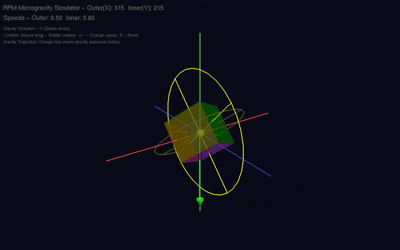

Random-Positioning Machine Microgravity Visualize Simulator (RPMSim-random)
An advanced interactive 3D simulator of Random Positioning Machines (RPM) with randomized rotation dynamics, designed to visualize and study microgravity simulation via gravity-vector averaging. This model extends the base RPM simulation by introducing stochastic rotational parameters, aligning with real-world RPM research requirements for minimizing biological adaptation to periodic motion.

# 📖 Overview

This project provides a high-fidelity, academic-grade 3D simulation of Random Positioning Machines (RPM)—a critical ground-based tool for microgravity research. Unlike fixed-ratio RPM simulators, RPMSim-random incorporates randomized rotation speeds, dynamic speed transitions, and adjustable speed ratio modes to replicate the quasi-random motion essential for suppressing biological graviresponse.
The simulator visualizes how RPMs achieve functional weightlessness by continuously reorienting a sample along two orthogonal axes (outer frame: X-axis; inner frame: Y-axis). By randomizing rotational parameters, it mimics the "quasi-ergodic" gravity vector coverage required for accurate biological and materials science experiments.



# 🔑 Key Features

Feature	Description
Adaptive Random Rotation	Supports three rotation ratio modes: fixed (e.g., golden ratio φ≈1.618), random (1.4–1.6 range), and alternating irrational ratios (√2, φ, 1.5, √3).
Smooth Speed Transitions	Gradual 2-second transitions between target speeds to avoid mechanical shock, with a maximum angular acceleration of 0.01 rad/s².
Real-Time Gravity Visualization	Green downward gravity vector (–Y direction) with an arrow indicator, plus an orange trajectory line tracking gravity exposure history.
Biological Sample Representation	Semi-transparent 6-colored cube (0.4f size) simulating biological samples, with face-specific colors for orientation tracking.
Dynamic Motor Feedback	Motor indicators change color with speed: blue (low) → green (medium) → red (high), providing intuitive speed monitoring.
Interactive Camera Control	Mouse drag to rotate the camera; preset initial angle (X:25°, Y:-35°) for optimal viewing.
Comprehensive Status Display	On-screen metrics: rotation angles, current speeds, ratio mode, transition state, and control instructions.

# 🧪 Scientific Background

RPMs simulate microgravity by gravity-vector averaging—a process where continuous reorientation of the sample makes the gravity vector change faster than the biological system’s response time. This results in a net experienced gravity approaching zero.
Critical Principles Implemented:
Quasi-Random Motion: Randomized speed ratios prevent periodic gravity vector patterns, avoiding biological adaptation (a key limitation of fixed-ratio clinostats).
Angular Velocity Range: Rotation speeds (0.3–0.7 rad/s) are calibrated to ensure gravity vector changes outpace typical biological response times (10s–hours for cells/plants).
Irrational Ratios: Alternating mode uses irrational numbers (e.g., golden ratio φ) to ensure non-repeating rotation patterns, maximizing gravity vector dispersion on the unit sphere.
🛠️ Installation & Compilation
Prerequisites
C++ Compiler (GCC, Clang, or MinGW)
OpenGL Libraries
GLUT (OpenGL Utility Toolkit) / FreeGLUT
GLU (OpenGL Utilities)
Compilation Commands
Linux/macOS

```bash
g++ -o rpmsim_random RPMSim-random.cpp -lGL -lGLU -lglut -lm
```

Windows (MinGW)

```bash
g++ -o rpmsim_random RPMSim-random.cpp -lopengl32 -lglut32 -lglu32 -lgdi32 -lwinmm
```

Note: For Windows, replace glut32 with freeglut if using FreeGLUT (recommended for better compatibility.

# ⚙️ Configurable Parameters

Modify the following constants in RPMSim-random.cpp to tune simulation behavior (located in the "Configurable Randomization Parameters" section):
Parameter	Default Value	Description
MIN_RATIO / MAX_RATIO	1.4f / 1.6f	Range for random speed ratios (inner/outer frame).
MIN_SPEED / MAX_SPEED	0.3f / 0.7f	Range for angular velocity (rad/s).
TARGET_CHANGE_INTERVAL	3.0f	Time (seconds) between automatic target speed changes.
USE_RANDOM_RATIO	true	Enable/disable random ratio mode (overrides fixed ratio).
FIXED_RATIO	GOLDEN_RATIO	Fixed ratio value (used only if USE_FIXED_RATIO = true).

# 📊 Simulation Output

The simulator displays real-time data at the bottom-left of the window:
Rotation Angles: Outer frame (X-axis) and inner frame (Y-axis) angles (°).
Speed Metrics: Current outer/inner frame speeds (rad/s) and speed ratio.
Mode Status: Active ratio mode (fixed/random/alternating) and ratio value.
Transition State: "Stable" (constant speed) or "Transitioning" (changing speeds).
Gravity Info: Gravity direction (–Y) and trajectory line description.

# 📄 License

This project is licensed under the MIT License—see the LICENSE file for details.

# 🎯 Recommended Use Cases

Academic research: Visualize RPM dynamics for papers or lab reports.
Educational demonstrations: Teach microgravity principles to students.
Pre-experiment testing: Validate rotation parameters before physical RPM experiments.
Protocol optimization: Test how random vs. fixed ratios affect gravity vector coverage.
Would you like me to add a "Troubleshooting" section (e.g., fixing GLUT installation errors) or a "Sample Workflow" (e.g., how to test a random ratio experiment) to the README? I can also generate a LICENSE file content snippet to include alongside the README.
